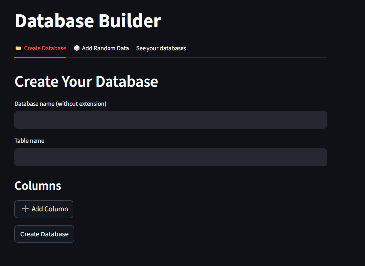
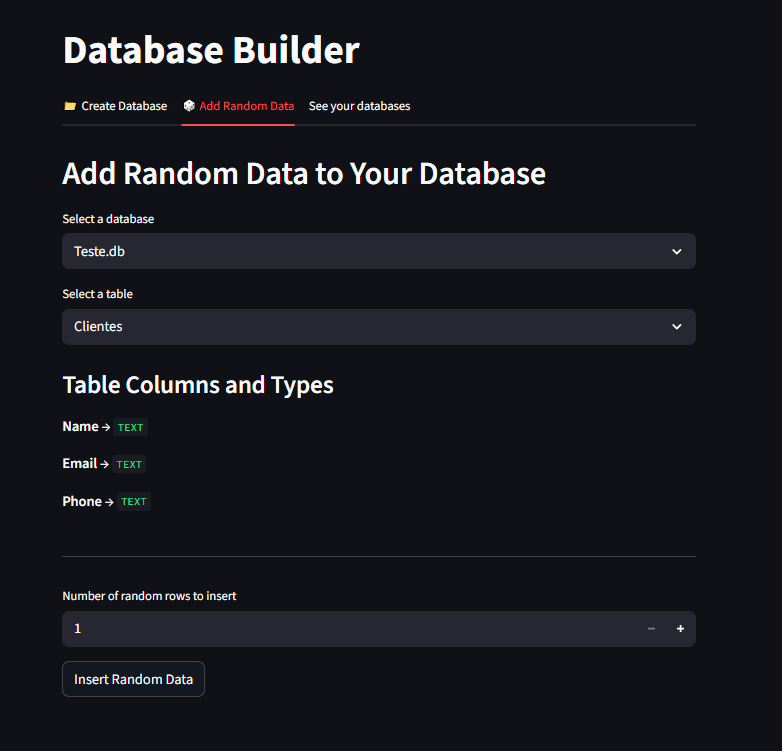

# 📁 Make Your Database

A Streamlit application that allows users to **create SQLite databases**, define custom columns, populate them with **random data using Faker**, and later **view or edit the content** — all through a simple and intuitive interface.

---

## 🛠️ Technologies Used

- **Python**
- **Streamlit**
- **SQLite**
- **Faker**
- **Docker**

---

## 🎯 Objective

This project allows the user to build custom `.db` SQLite databases by choosing:

- The database name
- The table name
- The columns and types
- The amount of random rows to insert

It also includes a section to **view**, **edit**, and **delete rows**.

---

## 🚀 Running the Project

### 🔹 Without Docker

pip install -r requirements.txt
streamlit run main.py

### 🔹 With Docker

docker build -t database-builder .
docker run -p 8000:8501 database-builder

## Screenshot of the Project

